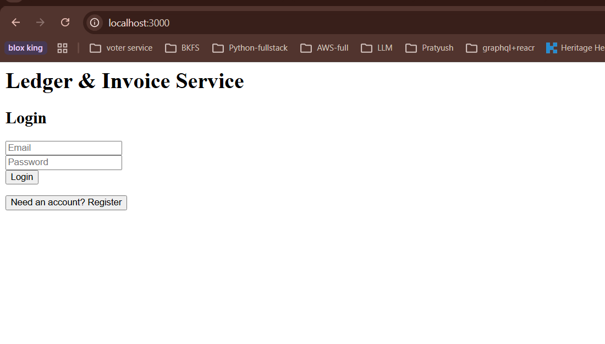
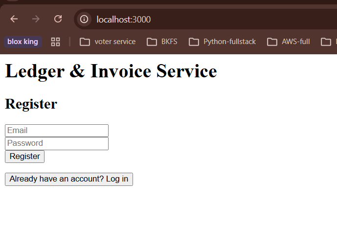
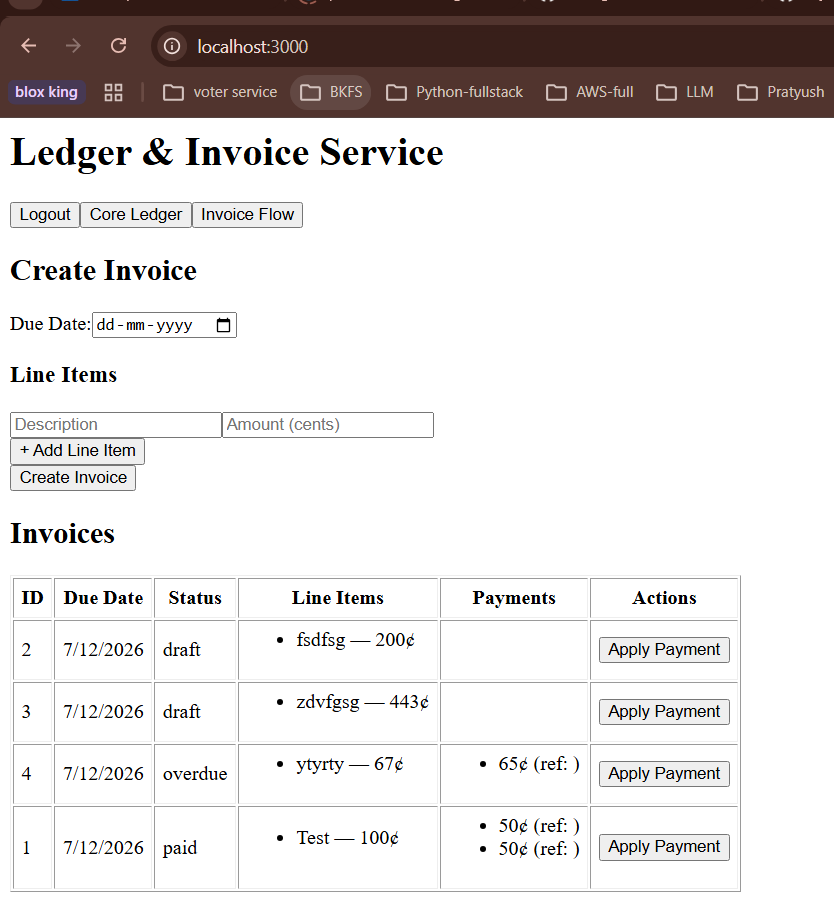
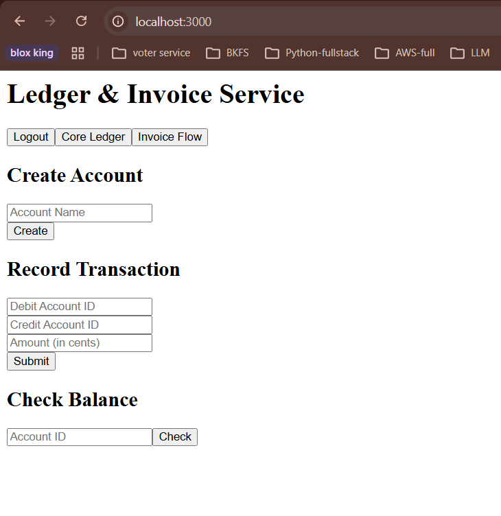

Ledger Service – Docker Compose Setup
    This guide walks you through running the full stack (React frontend, Express + Prisma backend, Postgres database) using Docker Compose.

## Prerequisites
    Install Docker
    Install Docker Compose
    Clone this repository locally

## Run the Application
    docker-compose up --build
    docker-compose ps

## Access the app
    Frontend → http://localhost:3000 (localhost in Bing)
    Backend API → http://localhost:4000 (localhost in Bing)
    Postgres → localhost:5432

## Note
    docker-compose exec backend npx prisma migrate dev

## Frontend UI
    Here’s what the app looks like running locally:
        
        
        
        

## Kubernetes clusetr deployment
    comming soon ...